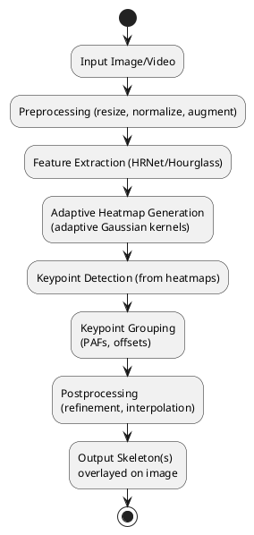

# Human Pose Estimation Workflow

## Overview and Motivation

Human pose estimation (HPE) aims to detect and localize human body keypoints in images or video, forming a skeleton representation for each person. Modern HPE systems are critical for applications in healthcare, sports analytics, surveillance, and human-computer interaction. Recent research has focused on improving robustness to scale, occlusion, and crowded scenes, with a shift toward adaptive, scale-aware, and bottom-up approaches (Cao et al., 2021; Yu et al., 2022; Du & Yu, 2022).

---

## Enhanced Workflow for Adaptive Bottom-Up Human Pose Estimation

The following workflow reflects the latest advances and your research objectives:

1. **Input Acquisition & Preprocessing**

   - Acquire image/video input (COCO, MPII, CrowdPose datasets).
   - Preprocess: resize, normalize, and augment (rotation, scaling, flipping, color jitter).
   - Ensure annotation integrity for multi-scale and occlusion scenarios.
2. **Feature Extraction**

   - Use a deep CNN backbone (e.g., HRNet, HigherHRNet, or Hourglass) to extract multi-scale, high-resolution features.
   - Fuse local and global context for robustness to scale and occlusion (Cheng et al., 2020).
3. **Adaptive Heatmap Generation**

   - Generate heatmaps for each keypoint using adaptive Gaussian kernels.
   - Kernel parameters (scale, orientation) are dynamically predicted based on local context and person instance (Yu et al., 2022; Du & Yu, 2022).
   - Incorporate scale-aware and orientation-aware mechanisms for fine-grained localization.
4. **Keypoint Detection & Grouping**

   - Detect all keypoints in the image from the adaptive heatmaps.
   - Use bottom-up grouping (e.g., Part Affinity Fields, offset regression) to associate keypoints into skeletons for each person (Cao et al., 2021).
5. **Efficient Learning & Optimization**

   - Employ multi-stage training, scale-aware loss functions, and regularization (Li et al., 2023; Wei et al., 2024).
   - Optimize for both accuracy and computational efficiency.
6. **Postprocessing**

   - Refine keypoints (non-maximum suppression, confidence thresholding).
   - Interpolate missing keypoints and ensure skeleton coherence.
   - Output: overlay skeletons on input, export as image/JSON/video for downstream tasks.

---

## Updated Workflow Diagram (PlantUML)

---

## Key Innovations and Literature Inspiration

- **Adaptive Gaussian Kernels**: Dynamically adjust kernel parameters for scale/orientation (Yu et al., 2022; Du & Yu, 2022).
- **Bottom-Up Grouping**: Efficiently associate keypoints in crowded scenes (Cao et al., 2021).
- **Multi-Scale Feature Fusion**: Robustness to scale/occlusion (Cheng et al., 2020).
- **Efficient Optimization**: Multi-stage training, advanced loss functions (Li et al., 2023; Wei et al., 2024).

---

This enhanced workflow and diagram reflect your research direction and the latest literature, providing a clear, modular, and scalable approach to bottom-up human pose estimation.

*References: Cao et al., 2021; Cheng et al., 2020; Yu et al., 2022; Du & Yu, 2022; Li et al., 2023; Wei et al., 2024.*
